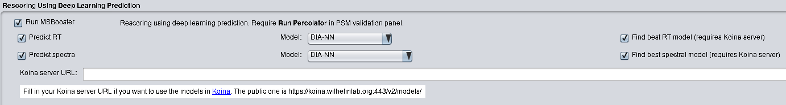
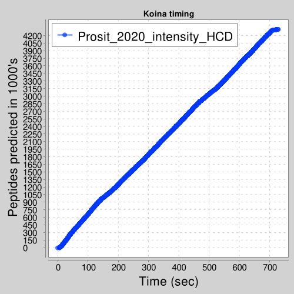
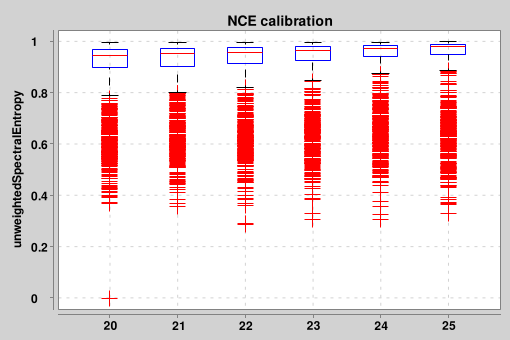

# Using Koina with MSBooster
Last updated: 9/24/2024

## Why use Koina?
[Koina](https://koina.proteomicsdb.org/) (described in 
[Lautenbacher, Yang et al.,_bioRxiv_, 2024](https://www.biorxiv.org/content/10.1101/2024.06.01.596953v1))
is an online service that allows us to leverage a GPU server to get predictions from multiple MS2 spectra, 
retention time (RT), and ion mobility (IM) models, thereby democratizing deep learning. The models on Koina may be 
more specific to your use case than the default prediction model, DIA-NN. As a result, predictions may be more accurate,
resulting in increased peptide identifications. The following models are currently supported by MSBooster:

| RT models            | MS2 models     | IM models  | 
|----------------------|---|---|
| Deeplc_hela_hf       | ms2pip_2021_HCD  | AlphaPept_ccs_generic  |
| AlphaPept_rt_generic | AlphaPept_ms2_generic  |   |
| Prosit_2019_irt      | Prosit_2019_intensity  |   |
| Prosit_2020_irt_TMT  | Prosit_2023_intensity_timsTOF  |   |
|                      | Prosit_2020_intensity_CID                               |   |
|                      | Prosit_2020_intensity_TMT                               |   |
|                      | Prosit_2020_intensity_HCD                               |   |
|                      | ms2pip_timsTOF2024                                                        |   |
|                      | ms2pip_TTOF5600                                                        |   |
|                      | ms2pip_Immuno_HCD                                                        |   |
|                      | UniSpec                                                                         |   |

You can mix and match models, or even use `DIA-NN` for one of them and a Koina model for the other.

## Using Koina
Koina can be used in the FragPipe GUI or the command line interface. Below we will describe usage in both places. 
Command line MSBooster has more flexible Koina functionality.

### FragPipe GUI

The core functionalities of Koina in MSBooster are implemented here.
- A dropdown menu allows you to choose your MS/MS and RT models
- Find best RT/spectral model can be checked to run a <a href="#notes">heuristic algorithm</a> 
that attempts to find the best MS2 and/or RT model for your data
- Koina server URL must be filled to tell MSBooster where to send its HTTP requests for prediction

### Command line
You can use the following command to run MSBooster, adjusting the -Xmx to how much RAM you have available.
```
java -Xmx14G -jar MSBooster-1.2.39.jar --paramsList msbooster_params.txt
```
An example parameter file for "--paramsList" can be found at [msbooster_params.txt](msbooster_params.txt). 
Important parameters when using Koina are explained below:
<details>
<summary>Koina required parameters</summary>
<ul>
    <li><code>KoinaURL (String)</code>: It is by default kept blank, as an acknowledgement that using it may potentially send the 
    peptides you are predicting to an external public server. If you are OK with this, you may use
    <code>https://koina.wilhelmlab.org:443/v2/models/</code> or a different URL (e.g. for a 
    <a href="#notes">private Koina instance</a>)</li>
    <li><code>rtModel (String)</code>: If kept blank, it will default to <code>DIA-NN</code>. You may specify this or any of the 
    RT models listed above. This will be ignored if <code>useRT</code> is set to false</li>
    <li><code>spectraModel (String)</code>: If kept blank, it will default to <code>DIA-NN</code>. You may specify this or any of 
    the MS2 models listed above. This will be ignored if <code>useSpectra</code> is set to false</li>
    <li><code>imModel (String)</code>: If kept blank, it will default to <code>DIA-NN</code>. You may specify this or any of 
    the IM models listed above. This will be ignored if <code>useIM</code> is set to false</li>
</ul>
</details>

<details>
<summary>Koina optional parameters</summary>
<ul>
    <li><code>findBestRtModel (boolean)</code>: Set to <code>true</code> if you would like to use the 
    <a href="#notes">heuristic best RT model</a> search to find which of the models offered works 
    best for your data. Otherwise, set as <code>false</code></li>
    <li><code>findBestSpectraModel (boolean)</code>: Set to <code>true</code> if you would like to use the heuristic best spectral 
    model search to find which of the models offered works best for your data. Otherwise, set as <code>false</code></li>
    <li><code>findBestImModel (boolean)</code>: Set to <code>true</code> if you would like to use the heuristic best IM model 
    search to find which of the models offered works best for your data. Otherwise, set as <code>false</code></li>
    <li><code>ms2SearchModelsString (String)</code>: Controls which models are searched during the heuristic best spectral model 
    search. It should be formatted with models separated by commas, and no spaces in between. If you would like to take
    out specific models, you can remove them from here. For example, if you are working with timsTOF data, you may want 
    to reduce the search to only those models that explicitly have timsTOF models (<code>AlphaPept_ms2_generic,
    Prosit_2023_intensity_timsTOF</code>). Models are case-insensitive (e.g. prosit_2020_Intensity_cid), but they must 
    be spelled correctly</li>
    <li><code>rtSearchModelsString (String)</code>: Same as <code>ms2SearchModelsString</code>, but for RT models. By default, it
    is set to <code>DIA-NN,AlphaPept_rt_generic,Prosit_2019_irt,Deeplc_hela_hf</code></li>
    <li><code>imSearchModelsString (String)</code>: Same as <code>ms2SearchModelsString</code>, but for IM models. By default, it
    is set to <code>DIA-NN,AlphaPept_ccs_generic</code></li>
    <li><code>calibrateNCE (boolean)</code>: Set to <code>true</code> if you would like to find the optimal collision energy for 
    MS2 predictions across the mzML files. Otherwise, set to <code>false</code> (default is true). NCE is only used in 
    Prosit and AlphaPeptDeep predictions. If false, MSBooster will attempt to read in the NCE from the mzML file.
    If it cannot find the NCE, it will be set to 25</li>
    <li><code>NCE (int)</code> (int): if calibrateNCE is <code>false</code>, then NCE can be used to explicitly specify NCE used for prediction</li>
    <li><code>instrument (String)</code>: instrument used for prediction. Only used by AlphaPeptDeep and Unispec. While MSBooster
    attempts to automatically read this from the mzml metadata, it can be explicitly provided here.
    <li><code>minNCE (int)</code>: the minimum NCE to search when calibrating NCE (default is 20)</li>
    <li><code>maxNCE (int)</code>: the maximum NCE to search when calibrating NCE (default is 40)</li>
    <li><code>numPSMsToCalibrate (int)</code>: number of PSMS to use for NCE calibration and best model search (default is 
    1000, the maximum numbers of peptides accepted in a single request to Koina)</li>
    <li><code>minIntensityToWriteToMgf (float)</code>: fragments with intensity below this value relative to the base peak 
    intensity will be filtered out. By default set to 0.01
    <li><code>autoSwitchFragmentation (boolean)</code>: whether or not to switch a model from HCD to CID and vice versa, if the mzml
    filter string metadata says so and an appropriate substitute model is available. This is set to <code>true</code> by default
</ul>
</details>

## Output files
In addition to [edited pin files, score histograms, and RT/IM calibration curves](README.md#graphical-output-files), several other files are produced when running Koina:
- `*_koina.mgf`: Contains the MS2/RT/IM predictions from the Koina models. RT/IM will be 0.0 if DIA-NN was used or no
RT/IM prediction was performed. This file is used in FragPipe-PDV for mirror plot visualization of experimental vs predicted
spectra, if MSBooster was most recently run with a Koina MS/MS model
- `Koina_timing_*.png`: A useful figure to keep track of how long it took to run the Koina model

- 
- `NCE_calibration*.png`: MS/MS similarities of the PSMs used to find the optimal NCE across files. The NCE with
highest median similarity is chosen. A few figures like this are produced, since there is a wide range of NCEs tested
that make it hard to visualize all in a single figure

  

## Log file examples

<details>
<summary> Set both models to AlphaPept </summary>

```
2024-07-24 13:25:13 [INFO] - MSBooster v1.2.38
2024-07-24 13:25:13 [INFO] - Using 55 threads
2024-07-24 13:25:13 [INFO] - Initializing example.mzML
2024-07-24 13:25:15 [INFO] - Instrument detected: QE
2024-07-24 13:25:15 [INFO] - Ion mobility values not found in data files, setting useIM to false.
2024-07-24 13:25:15 [INFO] - Fragmentation type detected: HCD
2024-07-24 13:25:15 [INFO] - NCE detected: 27.0
2024-07-24 13:25:16 [INFO] - Creating input file for createFull
2024-07-24 13:25:16 [INFO] - 32135 PSMs for prediction
2024-07-24 13:25:16 [INFO] - createFull input file generation took 163 milliseconds
2024-07-24 13:25:16 [INFO] - Input file at spectraRT_full.tsv
2024-07-24 13:25:16 [INFO] - Calibrating NCE
2024-07-24 13:25:26 [INFO] - Best NCE for AlphaPept_ms2_generic after calibration is 28
2024-07-24 13:25:26 [INFO] - Median similarity for AlphaPept_ms2_generic is 0.9864
2024-07-24 13:25:26 [INFO] - Creating input file for AlphaPept_ms2_generic
2024-07-24 13:25:27 [INFO] - 31944 PSMs for prediction
2024-07-24 13:25:27 [INFO] - AlphaPept_ms2_generic input file generation took 385 milliseconds
2024-07-24 13:25:27 [INFO] - Input files in jsonFiles
2024-07-24 13:25:27 [INFO] - Creating input file for AlphaPept_rt_generic
2024-07-24 13:25:27 [INFO] - 31944 PSMs for prediction
2024-07-24 13:25:27 [INFO] - AlphaPept_rt_generic input file generation took 157 milliseconds
2024-07-24 13:25:27 [INFO] - Input files in jsonFiles
2024-07-24 13:25:27 [INFO] - Calling AlphaPept_ms2_generic model
...10%...20%...30%...40%...50%...60%...70%...80%...90%...100%
2024-07-24 13:25:36 [INFO] - cURL and parse time in milliseconds: 8731
2024-07-24 13:25:36 [INFO] - Calling AlphaPept_rt_generic model
...10%...20%...30%...40%...50%...60%...70%...80%...90%...100%
2024-07-24 13:25:48 [INFO] - cURL and parse time in milliseconds: 11913
```
</details>

<details>
<summary> Running heuristic best model search </summary>

```
2024-07-24 13:09:39 [INFO] - MSBooster v1.2.38
2024-07-24 13:09:39 [INFO] - Using 55 threads
2024-07-24 13:09:39 [INFO] - Initializing example.mzML
2024-07-24 13:09:41 [INFO] - Instrument detected: QE
2024-07-24 13:09:41 [INFO] - Ion mobility values not found in data files, setting useIM to false.
2024-07-24 13:09:41 [INFO] - Fragmentation type detected: HCD
2024-07-24 13:09:41 [INFO] - NCE detected: 27.0
2024-07-24 13:09:41 [INFO] - Searching for best RT model for your data
2024-07-24 13:09:41 [INFO] - Searching the following models:
2024-07-24 13:09:41 [INFO] - [DIA-NN, Deeplc_hela_hf, AlphaPept_rt_generic, Prosit_2019_irt, Prosit_2020_irt_TMT]
Iteration 1...2...3...4...5...
2024-07-24 13:09:46 [INFO] - DIA-NN has root mean squared error of 3.1493
Iteration 1...2...3...4...5...
2024-07-24 13:09:48 [INFO] - Deeplc_hela_hf has root mean squared error of 3.8912
Iteration 1...2...3...4...5...
2024-07-24 13:09:54 [INFO] - AlphaPept_rt_generic has root mean squared error of 4.4811
Iteration 1...2...3...4...5...
2024-07-24 13:09:55 [INFO] - Prosit_2019_irt has root mean squared error of 6.2771
Iteration 1...2...3...4...5...
2024-07-24 13:09:56 [INFO] - Prosit_2020_irt_TMT has root mean squared error of 14.5587
2024-07-24 13:09:56 [INFO] - RT model chosen is DIA-NN
2024-07-24 13:09:56 [INFO] - Searching for best spectra model for your data
2024-07-24 13:09:56 [INFO] - Searching the following models:
2024-07-24 13:09:56 [INFO] - [ms2pip_2021_HCD, AlphaPept_ms2_generic, Prosit_2019_intensity, Prosit_2020_intensity_CID, Prosit_2020_intensity_HCD]
2024-07-24 13:09:57 [INFO] - Median similarity for ms2pip_2021_HCD is 0.9781
2024-07-24 13:09:57 [INFO] - Calibrating NCE
2024-07-24 13:10:12 [INFO] - Best NCE for AlphaPept_ms2_generic after calibration is 28
2024-07-24 13:10:12 [INFO] - Median similarity for AlphaPept_ms2_generic is 0.9864
2024-07-24 13:10:12 [INFO] - Calibrating NCE
2024-07-24 13:10:16 [INFO] - Best NCE for Prosit_2019_intensity after calibration is 35
2024-07-24 13:10:16 [INFO] - Median similarity for Prosit_2019_intensity is 0.9760
2024-07-24 13:10:17 [INFO] - Median similarity for Prosit_2020_intensity_CID is 0.8080
2024-07-24 13:10:17 [INFO] - Calibrating NCE
2024-07-24 13:10:22 [INFO] - Best NCE for Prosit_2020_intensity_HCD after calibration is 35
2024-07-24 13:10:22 [INFO] - Median similarity for Prosit_2020_intensity_HCD is 0.9808
2024-07-24 13:10:23 [INFO] - Spectra model chosen is AlphaPept_ms2_generic
2024-07-24 13:10:23 [INFO] - Creating input file for createFull
2024-07-24 13:10:23 [INFO] - 32135 PSMs for prediction
2024-07-24 13:10:23 [INFO] - createFull input file generation took 185 milliseconds
2024-07-24 13:10:23 [INFO] - Input file at spectraRT_full.tsv
2024-07-24 13:10:23 [INFO] - Creating input file for AlphaPept_ms2_generic
2024-07-24 13:10:23 [INFO] - 31944 PSMs for prediction
2024-07-24 13:10:23 [INFO] - AlphaPept_ms2_generic input file generation took 258 milliseconds
2024-07-24 13:10:23 [INFO] - Input files in jsonFiles
2024-07-24 13:10:23 [INFO] - Generating input file for DIA-NN
2024-07-24 13:10:23 [INFO] - Creating input file for Diann
2024-07-24 13:10:23 [INFO] - 31944 PSMs for prediction
2024-07-24 13:10:23 [INFO] - Writing DIA-NN input file
2024-07-24 13:10:23 [INFO] - Diann input file generation took 118 milliseconds
2024-07-24 13:10:23 [INFO] - Input file at spectraRT.tsv
2024-07-24 13:10:23 [INFO] - Calling AlphaPept_ms2_generic model
...10%...20%...30%...40%...50%...60%...70%...80%...90%...100%
2024-07-24 13:10:33 [INFO] - cURL and parse time in milliseconds: 10130
2024-07-24 13:10:34 [INFO] - Generating DIA-NN predictions
2024-07-24 13:10:34 [INFO] - diann/1.8.2_beta_8/linux/diann-1.8.1.8 --lib spectraRT.tsv --predict --threads 55 --strip-unknown-mods --predict-n-frag 100
2024-07-24 13:10:34 [INFO] - DIA-NN 1.8.2 beta 8 (Data-Independent Acquisition by Neural Networks)
2024-07-24 13:10:34 [INFO] - Compiled on Dec  1 2022 14:47:06
2024-07-24 13:10:34 [INFO] - Current date and time: Wed Jul 24 13:10:34 2024
2024-07-24 13:10:34 [INFO] - Logical CPU cores: 72
2024-07-24 13:10:34 [INFO] - Predicted spectra will be saved in a binary format
2024-07-24 13:10:34 [INFO] - Thread number set to 55
2024-07-24 13:10:34 [INFO] - DIA-NN will use deep learning to predict spectra/RTs/IMs even for peptides carrying modifications which are not recognised by the deep learning predictor. In this scenario, if also generating a spectral library from the DIA data or using the MBR mode, it might or might not be better (depends on the data) to also use the --out-measured-rt option - it's recommended to test it with and without this option
2024-07-24 13:10:34 [INFO] - Deep learning predictor will predict 100 fragments
2024-07-24 13:10:34 [INFO] -
2024-07-24 13:10:34 [INFO] - 0 files will be processed
2024-07-24 13:10:34 [INFO] - [0:00] Loading spectral library spectraRT.tsv
2024-07-24 13:10:34 [INFO] - [0:00] Finding proteotypic peptides (assuming that the list of UniProt ids provided for each peptide is complete)
2024-07-24 13:10:34 [INFO] - [0:00] Spectral library loaded: 0 protein isoforms, 0 protein groups and 31944 precursors in 27896 elution groups.
2024-07-24 13:10:36 [INFO] - [0:02] Encoding peptides for spectra and RTs prediction
2024-07-24 13:10:36 [INFO] - [0:02] Predicting spectra and IMs
2024-07-24 13:10:39 [INFO] - [0:05] Predicting RTs
2024-07-24 13:10:40 [INFO] - [0:06] Decoding predicted spectra and IMs
2024-07-24 13:10:40 [INFO] - [0:06] Decoding RTs
2024-07-24 13:10:40 [INFO] - [0:06] Saving the list of predictions to spectraRT.predicted.bin
2024-07-24 13:10:40 [INFO] - Finished
2024-07-24 13:10:41 [INFO] - Done generating DIA-NN predictions
2024-07-24 13:10:41 [INFO] - Model running took 7236 milliseconds
2024-07-24 13:10:41 [INFO] - Generating edited pin with following features: [predRTrealUnits, unweightedSpectralEntropy, deltaRTLOESS]
2024-07-24 13:10:41 [INFO] - Loading predicted spectra
2024-07-24 13:10:41 [INFO] - Loading predicted retention times
2024-07-24 13:10:42 [INFO] - Merging libraries
```
</details>

## Notes
<details>
<summary> Using a private server </summary>

While there is a public Koina server at https://koina.wilhelmlab.org:443/v2/models/ and the Koina team has stated that 
the peptides submitted are not stored after returning model predictions, you may find it safer to set up your own Koina 
server, provided you have access to a GPU. You may follow the directions 
[here](https://github.com/wilhelm-lab/koina?tab=readme-ov-file#hosting-your-own-server)
to set one up with the Docker image provided. The Ansible script is recommended to download all dependencies. Once your
server is ready, you can substitute the public Koina URL with your new URL.
</details>

<details>
<summary> Heuristic best model search </summary>

As Koina continues to grow and support more models, it may become overwhelming to determine which combinations of models 
best improves PSM rescoring for the dataset at hand. To maximize numbers of identified peptides, we have incorporated an 
optional module in MSBooster that attempts to quickly determine the best models for a dataset. For MS/MS models, the 
model selected is the one in which the 1000 best (lowest expectation value) PSMs achieve the highest median similarity.
For RT and IM models, the 10 out of the 1000 best PSMs with highest delta RT/IM scores are examined. The model which
keeps that delta score to a minimum is selected.

To use this feature, either check the boxes "Find best <spectral/RT/IM> model" in the FragPipe GUI, or use 
"findBest<spectra/RT/IM>Model" in the parameter file via the command line.
</details>

<details>
<summary> TODO </summary>

- Add IM boxes to FragPipe GUI
- Improve heuristic searches (MS2 performance ~98%, RT performance ~90%, IM untested)
- Different optimal NCE for each mzML file
- Add documentation for instruments
</details>

## How to cite
Please cite the following when using Koina with MSBooster: https://www.biorxiv.org/content/10.1101/2024.06.01.596953v1