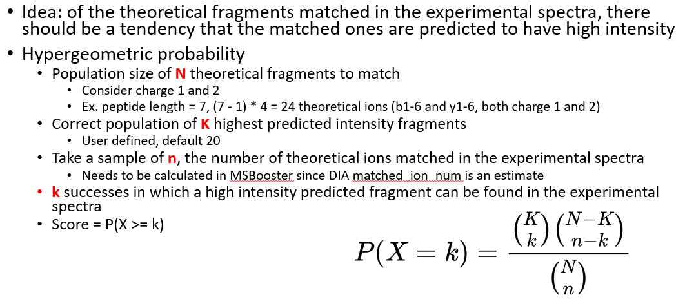

# MSBooster
Last updated: 1/14/2026

## Overview
MSBooster is a tool for incorporating spectral libary predictions into peptide-spectrum match (PSM) 
rescoring in bottom-up tandem liquid chromatography mass spectrometry proteomics data. It is roughly
broken into 4 steps:
1. Peptide extraction from PSMs in search results, and formatting for machine/deep learning (ML/DL) 
predictors' input files
2. Calling the prediction model(s) and saving the output
3. Feature calculation
4. Addition of new features to the search results file

MSBooster is compatible with many types of database searches, including HLA immunopeptidomics, DDA and
DIA, and single cell proteomics. It is incorporated into [FragPipe](https://fragpipe.nesvilab.org/) 
and is included in many of its workflows. MSBooster was developed with other FragPipe tools in mind, 
such as FragPipe-PDV.

## Calculated features
Listed here are definitions of the default calculated features. An exhaustive list of all possible features is coming:
- Unweighted spectral entropy: requires fragment ion intensity
  vectors to sum to 1. p stands for predicted fragment, P for predicted
  intensity vector, m for matched experimental fragment, and M for matched
  experimental intensity vector. By default, the top 20 highest predicted intensity
  fragments are used.
  $$1 - \frac{2S_{PM} - S_P - S_M}{\ln 4}$$
where entropy
$$S = -\sum_{i=1}^{n} f_i \ln f_i$$
and $S_{PM}$ is the sum of predicted and matched vectors $S_P$ and $S_M$ divided by 2
- Weighted spectral entropy: The unweighted spectral entropy score is biased towards higher scores for shorter peptides.
We combat this by normalizing the unweighted score with the square root of the predicted intensity vector entropy
  $$W = U\sqrt{S_P}$$
where W is the weighted score, U the unweighted score
- Hypergeometric probability:
  
- Intersection: of the top 20 highest intensity annotate peaks in the experimental spectrum (by default, b and y ions), how many of
them are in the top 20 highest predicted intensity fragments?
- Top 6 matched intensity: Set all experimental fragment intensities to their natural logs. Of the top 6 highest intensity
 predicted fragments, take their sum and divide it by the sum of intensities of all experimental peaks 
**with intensities greater than the mean fragment intensity in the spectrum**
- Delta RT loess: after performing RT calibration between the predicted and experimental units (process described in
MSBooster paper), calculate the difference between the calibrated predicted RT of the peptide and the MS2 scan RT. The
score is reported in predicted RT units
- Delta RT loess real: similar idea to delta RT loess, but calibration is performed from predicted to experimental time
scales, and the score is reported in minutes
- Delta IM loess: similar idea to delta RT loess. A separate calibration is done per charge state
- Ion mobility: experimental ion mobility. This is independent of the predicted IM

## Accepted inputs and models
MSBooster is equipped to handle multiple input file formats and models:

| Mass spectrometer output |
| --- |
| .mzML |
| .mgf |

| PSM file |
| --- |
| .pin |
| .pepXML (in progress) |

| Prediction model                             |
|----------------------------------------------|
| [DIA-NN](https://github.com/vdemichev/DiaNN) |
| [Koina models](Koina.md)                     |

## Installation and running guide
### In FragPipe
MSBooster can be run in Windows and Linux systems. If using FragPipe, no other installation steps are
needed besides installing FragPipe. MSBooster is located in the "Validation" tab. Choose to enable 
retention time features with "Predict RT" and MS/MS spectral features with "Predict spectra". Please refer to the 
[FragPipe](https://fragpipe.nesvilab.org/) documentation for how to run an analysis.

### On the command line
If using standalone MSBooster to run in the command line, please download the latest jar file from 
Releases. MSBooster also requires DIA-NN for MS/MS and RT prediction. Please install 
[DIA-NN](https://github.com/vdemichev/DiaNN) and take note of the path to the DIA-NN executable 
(ex. DiaNN.exe for Windows, diann-1.8.1.8 for Linux).

You can run MSBooster using a command similar to the following: 

    java -jar MSBooster-1.2.1.jar --paramsList msbooster_params.txt
    
The minimum parameters needing to be passed are:

    - DiaNN (String): path to DIA-NN executable (if using DIA-NN model, which is the MSBooster default)
    - mzmlDirectory (String): path to mzML/mgf files. Accepts multiple space-separated folder and files
    - pinPepXMLDirectory (String): path to pin files. Accepts multiple space-separated folder and files.
      If using in FragPipe, place the pin and pepXML files in the same folder

While you can individually pass these parameters, it is easier to place one 
on each line of the paramsList file. Please refer to [msbooster_params.txt](msbooster_params.txt)
for a template.

## Optional parameters
The parameters below are for general use. Koina-specific parameters are in [the Koina documentation](Koina.md#command-line)

General input/output and processing

<ul>
  <li><code>paramsList (String)</code>: location to text file containing parameters for this run
  <li><code>fragger (String)</code>: file path of fragger.params file from the MSFragger run. MSBooster will read in multiple parameters
and adjust internal parameters based on them, such as fragment mass error tolerance and mass offsets
  <li><code>outputDirectory (String)</code>: where to output the new files
  <li><code>editedPin (String)</code>: MSBooster will name the new file based on the ones provided. For example, A.pin will have a counterpart 
called A_edited.pin. To change from the default of "edited", provide a new string here
  <li><code>renamePin (int)</code>: whether to generate a new pin file or rewrite the old one. Default here is 1, which will not overwrite. 
Setting this to 0 will overwrite the old pin file
  <li><code>deletePreds (boolean)</code>: whether to delete the files storing model predictions after finishing a succesful run. By default, set
to false. Set to true if you wish to delete these
  <li><code>loadingPercent (int)</code>: how often to report progress on tasks using a progress reporter. By default, set to 10, meaning an 
update will be printed every 10%. 
  <li><code>numThreads (int)</code>: number of threads to use. By default set to 0, which uses all available threads minus 1
  <li><code>splitPredInputFile (int)</code>: only used when DIA-NN predictions fail due to an out of memory error (137). By default, set
to 1, but you can increase this to specify how many smaller files the DIA-NN input file should be broken up into. Each
file will then be predicted sequentially, easy the memory burden
  <li><code>plotExtension (String)</code>: what file format plots should be in. png by default, and pdf is also allowed
  <li><code>features (String)</code>: list of features to be calculated. Case-sensitive, comm-separated without spaces in between.
Default is <code>unweightedSpectralEntropy,weightedSpectralEntropy,hypergeometricProbability,intersection,
top6matchedIntensity,deltaRTLOESS,deltaRTLOESSreal,deltaIMLOESS,ionmobility</code>
</ul>

Enabling, specifying, and loading predictions

<ul>
  <li><code>spectraPredFile (String)</code>: if you are reusing old spectral predictions (e.g. from DIA-NN or Koina), you can specify the file
location here
  <li><code>RTPredFile (String)</code>: same as spectraPredFile, but for RT predictions
  <li><code>IMPredFile (String)</code>: same as spectraPredFile, but for IM predictions
  <li><code>spectraModel (String)</code>: which spectral prediction model to use
  <li><code>rtModel (String)</code>: same as spectraModel, but for RT
  <li><code>imModel (String)</code>: same as spectraModel, but for IM
  <li><code>useSpectra (boolean)</code>: whether to use spectral prediction-based features. Set to true by default
  <li><code>useRT (boolean)</code>: whether to use RT prediction-based features. Set to true by default
  <li><code>useIM (boolean)</code>: whether to use IM prediction-based features. Set to false by default
</ul>

MS/MS spectral processing

<ul>
  <li><code>ppmTolerance (float)</code>: fragment error ppm tolerance (default 20ppm)
  <li><code>matchWithDaltons (boolean)</code>: whether to match predicted and observed fragments in Daltons (default false)
  <li><code>DaTolerance (float)</code>: how many daltons around the predicted peak to look for experimental peak (default 0.05)
  <li><code>useTopFragments (boolean)</code>: whether to filter spectral prediction to the N highest intensity peaks (default true)
  <li><code>topFragments (int)</code>: up to how many predicted fragments should be used for feature calculation (default 20). Only 
applied if useTopFragments is true
  <li><code>useBasePeak (boolean)</code>: whether a lower limit should be applied to MS2 predictions to only use fragments with higher
intensity (default true)
  <li><code>percentBasePeak (float)</code>: percent at which fragment with intensity of some percent of base peak intensity is included
in similarity calculation. Only applied if useBasePeak is true (default 1)
</ul>

RT/IM prediction

<ul>
  <li><code>loessEscoreCutoff (float)</code>: expectation value cutoff used for first pass at collecting PSMs for RT/IM calibration.
Default is 10^-3.5, or approximately 0.000316
  <li><code>rtLoessRegressionSize (int)</code>: maximum number of PSMs used for RT LOESS calibration (default 5000)
  <li><code>imLoessRegressionSize (int)</code>: same as rtLoessRegressionSize but for IM (default 1000)
  <li><code>minLoessRegressionSize (int)</code>: minimum number of PSMs needed to attempt LOESS RT/IM calibration (default 100). If fewer than
this number of PSMs are available, linear regression is used instead
  <li><code>minLinearRegressionSize (int)</code>: minimum number of PSMs needed to attempt linear regression RT/IM calibration (default 10).
If fewer than this number of PSMs are available, no calibration is attempted
  <li><code>loessBandwidth (String)</code>: list of bandwidths to try for RT/IM LOESS calibration (default 0.01,0.05,0.1,0.2). This must
be comma-separated with no spaces in between
  <li><code>regressionSplits (int)</code>: number of cross validations used for RT/IM LOESS calibration (default 5)
  <li><code>massesForLoessCalibration (String)</code>: masses for mass shifts that should be fit to their own calibration curves. List
is comma-separated with no spaces in between. The masses should be written to the same number of digits as in the PIN file
  <li><code>loessScatterOpacity (float)</code>: opacity of scatter plots in LOESS calibration figures, from 0 to 1 (default 0.35)
</ul>

## Output files
 - .pin file with new features. By default, new pin files will be produced ending in "_edited.pin". The
 default features used are "unweighted_spectral_entropy", "delta_RT_loess", and "pred_RT_real_units". If ion mobility
 features are enabled, "delta_IM_loess" and "ion_mobility" will also be included
 - spectraRT.tsv and spectraRT_full.tsv: input files for DIA-NN prediction model
 - spectraRT.predicted.bin: a binary file with predictions from DIA-NN to be used by MSBooster for 
feature calculation. If using FragPipe-PDV, these files are used to generate mirror plots of experimental
and predicted spectra

## Graphical output files
MSBooster produces multiple graphs that can be used to further examine how your data compares to model
predictions.

- RT_calibration_curves: up to the top 5000 PSMs will be used for calibration between the 
experimental and predicted RT scales. These top PSMs are presented in the graph, not all PSMs. 
Two graphs will be produced per pin file, the first plotting predicted RT on the y axis, the second plotting calibrated RT
  (predicted RT adjusted onto the experimented scale); the second plot will have the suffix `_calibrated`

- IM_calibration_curves: up to the top 1000 PSMs will be used for calibration between the
  experimental and predicted IM scales. These top PSMs are presented in the graph, not all PSMs. A separate curve
  will be learned for each charge state. The figure below is an example for charge 2 precursors

- score_histograms: overlayed histograms of all target and decoy PSMs for each pin file. Some 
features are plotted here on a log scale for better visualization of the bimodal distribution of
true and false positives, but the original value is what is used in the pin files, not the log-scaled
version. Shown here are histograms for the unweighted spectral entropy and delta RT scores, but similar ones are
produced for all features

- cumulativeQC (summarizing all runs together): 
  - RT_regression_curves: RT curves for all runs are plotted together, making it easier to spot any outlier runs
    
  - cumulative_absDeltaRT_trend: 5th, 50th, and 95th percentiles of deltaRT scores across the entire LC. The same top
  5000 PSMs from the RT calibration are used to calculate percentiles, and a moving average is applied for plotting the 
  trendline
    
  - cumulative_deltaRT_lineplot and cumulative_MS2_lineplot: files are sorted in order of the median delta RT (minutes)
  and spectral similarity (unweighted spectral entropy similarity) of all PSMs with evalue below the expectation value 
  cutoff. 5th, 25th, 50th, 75th, and 95th percentiles are plotted
    
    

## Tutorials
- Use peptide prediction models from Koina for MSBooster feature generation: https://fragpipe.nesvilab.org/docs/tutorial_koina.html
- [Reading in predictions from any model via MGF files](ReadMgfPredictions.md)
    
## How to cite
Please cite the following when using MSBooster: https://www.nature.com/articles/s41467-023-40129-9 