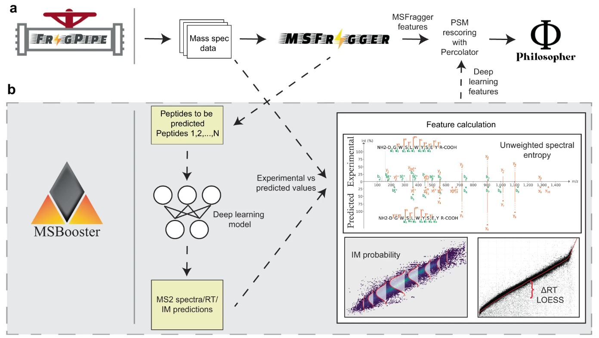

# MSBooster

## Overview
MSBooster is a tool for incorporating spectral libary predictions into peptide-spectrum match (PSM) 
rescoring in bottom-up tandem liquid chromatography mass spectrometry proteomics data. It is roughly
broken into 4 steps:
1. Peptide extraction from PSMs in search results, and formatting for machine/deep learning (ML/DL) 
predictors' input files
2. Calling the prediction model(s) and saving the output
3. Feature calculation
4. Addition of new features to the search results file

MSBooster is compatible with many types of database searches, including HLA immunopeptidomics, DDA and
DIA, and single cell proteomics. It is incorporated into [FragPipe](https://fragpipe.nesvilab.org/) 
and is included in many of its workflows. MSBooster was developed with other FragPipe tools in mind, 
such as FragPipe-PDV.

## Accepted inputs and models
MSBooster is equipped to handle multiple input file formats and models:

| Mass spectrometer output |
| --- |
| .mzML |
| .mgf |

| PSM file |
| --- |
| .pin |
| .pepXML (in progress) |

| Prediction model |
| --- |
| [DIA-NN](https://github.com/vdemichev/DiaNN) |

## Installation and running guide
### In FragPipe
MSBooster can be run in Windows and Linux systems. If using FragPipe, no other installation steps are
needed besides installing FragPipe. MSBooster is located in the "Validation" tab. Choose to enable 
retention time features with "Predict RT" and MS/MS spectral features with "Predict spectra". "Use 
correlated features" calculates multiple linearly correlated features, such as dot product and spectral 
entropy, to add to your output file. This may increase or decrease your peptide IDs, as noted in the 
[MSBooster manuscript](https://www.nature.com/articles/s41467-023-40129-9). Please refer to the 
[FragPipe](https://fragpipe.nesvilab.org/) documentation for how to run an analysis.

### On the command line
If using standalone MSBooster to run in the command line, please download the latest jar file from 
Releases. MSBooster also requires DIA-NN for MS/MS and RT prediction. Please install 
[DIA-NN](https://github.com/vdemichev/DiaNN) and take note of the path to the DIA-NN executable 
(ex. DiaNN.exe for Windows, diann-1.8.1.8 for Linux).

You can run MSBooster using a command similar to the following: 

    java -jar MSBooster-1.2.1.jar --paramsList msbooster_params.txt
    
The minimum parameters needing to be passed are:

    - DiaNN: path to DIA-NN executable
    - mzmlDirectory: path to mzML/mgf files. Accepts multiple space-separated folder and files
    - pinPepXMLDirectory: path to pin files. Accepts multiple space-separated folder and files.
      If using in FragPipe, place the pin and pepXML files in the same folder

While you can individually pass these parameters, it is easier to place one 
on each line of the paramsList file. Please refer to [msbooster_params.txt](msbooster_params.txt)
for a template.

## Optional parameters

## Output files
 - .pin file with new features. By default, new pin files will be produced ending in "_edited.pin". The
 default features used are "unweighted_spectral_entropy" and "delta_RT_loess"
 - spectraRT.tsv and spectraRT_full.tsv: input files for DIA-NN prediction model
 - spectraRT.predicted.bin: a binary file with predictions from DIA-NN to be used by MSBooster for 
feature calculation. If using FragPipe-PDV, these files are used to generate mirror plots of experimental
and predicted spectra

## Graphical output files
MSBooster produces multiple graphs that can be used to further examine how your data compares to model
predictions.
 - MSBooster_plots folder:
    - RT_calibration_curves: up to the top 5000 PSMs will be used for calibration between the 
    experimental and predicted RT scales. These top PSMs are presented in the graph, not all PSMs. 
    One graph will be produced per pin file
    
    - score_histograms: overlayed histograms of all target and decoy PSMs for each pin file. Some 
    features are plotted here on a log scale for better visualization of the bimodal distribution of
    true and false positives, but the original value is what is used in the pin files, not the log-scaled
    version.
    
    
    
## How to cite
- Please cite the following when using MSBooster: https://www.nature.com/articles/s41467-023-40129-9 