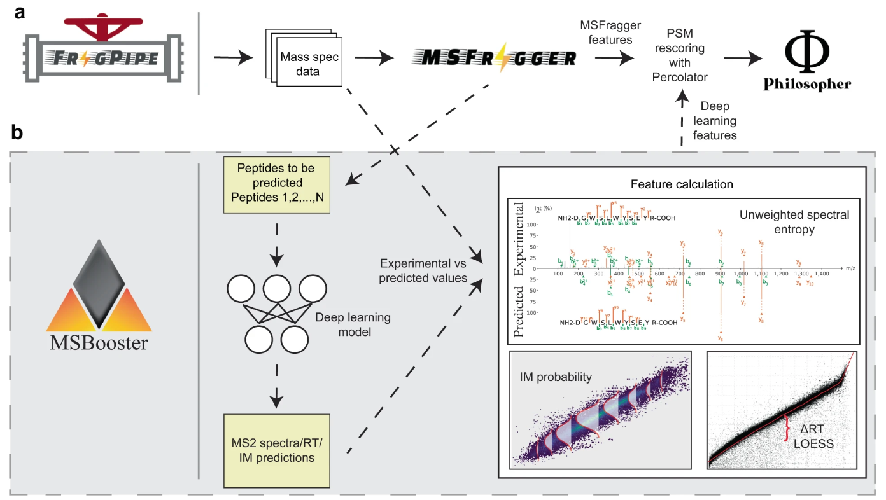
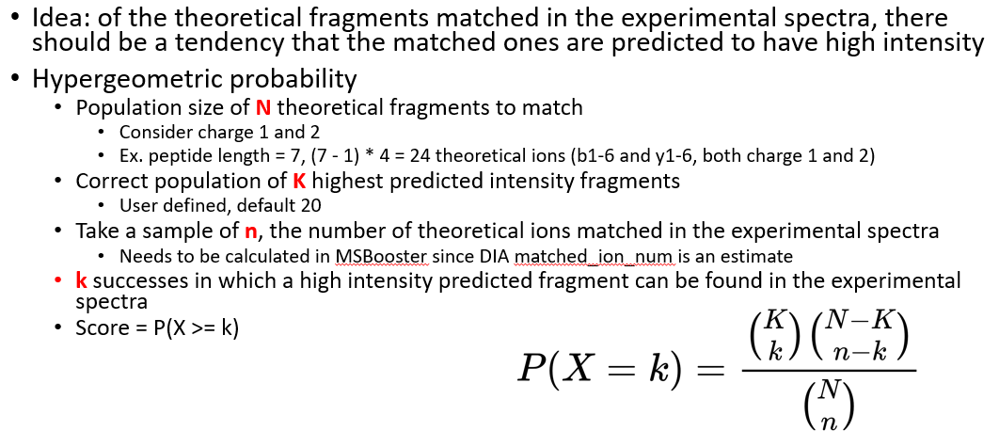
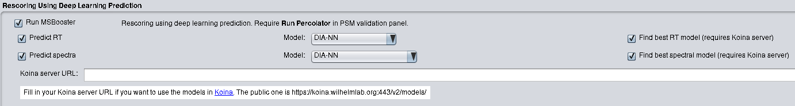

# MSBooster
Last updated: 8/22/2026

## Overview
MSBooster is a tool for incorporating spectral libary predictions into peptide-spectrum match (PSM) 
rescoring in bottom-up tandem liquid chromatography mass spectrometry proteomics data. It is roughly
broken into 4 steps:
1. Peptide extraction from PSMs in search results, and formatting for machine/deep learning (ML/DL) 
predictors' input files
2. Calling the prediction model(s) and saving the output
3. Feature calculation
4. Addition of new features to the search results file

MSBooster is compatible with many types of database searches, including HLA immunopeptidomics, DDA and
DIA, and single cell proteomics. It is incorporated into [FragPipe](https://fragpipe.nesvilab.org/) 
and is included in many of its workflows. MSBooster was developed with other FragPipe tools in mind, 
such as FragPipe-PDV.



## Calculated features
Listed here are definitions of the default calculated features. An exhaustive list of all possible features is coming:
- Unweighted spectral entropy: requires fragment ion intensity
  vectors to sum to 1. p stands for predicted fragment, P for predicted
  intensity vector, m for matched experimental fragment, and M for matched
  experimental intensity vector. By default, the top 20 highest predicted intensity
  fragments are used.
  $$1 - \frac{2S_{PM} - S_P - S_M}{\ln 4}$$
where entropy
$$S = -\sum_{i=1}^{n} f_i \ln f_i$$
and $S_{PM}$ is the sum of predicted and matched vectors $S_P$ and $S_M$ divided by 2
- Weighted spectral entropy: The unweighted spectral entropy score is biased towards higher scores for shorter peptides.
We combat this by normalizing the unweighted score with the square root of the predicted intensity vector entropy
  $$W = U\sqrt{S_P}$$
where W is the weighted score, U the unweighted score
- Hypergeometric probability:
  
- Intersection: of the top 20 highest intensity annotate peaks in the experimental spectrum (by default, b and y ions), how many of
them are in the top 20 highest predicted intensity fragments?
- Top 6 matched intensity: Set all experimental fragment intensities to their natural logs. Of the top 6 highest intensity
 predicted fragments, take their sum and divide it by the sum of intensities of all experimental peaks 
**with intensities greater than the mean fragment intensity in the spectrum**
- Delta RT loess: after performing RT calibration between the predicted and experimental units (process described in
MSBooster paper), calculate the difference between the calibrated predicted RT of the peptide and the MS2 scan RT. The
score is reported in predicted RT units
- Delta RT loess real: similar idea to delta RT loess, but calibration is performed from predicted to experimental time
scales, and the score is reported in minutes
- Delta IM loess: similar idea to delta RT loess. A separate calibration is done per charge state
- Ion mobility: experimental ion mobility. This is independent of the predicted IM

## Accepted inputs and models
MSBooster is equipped to handle multiple input file formats and models:

| Mass spectrometer output |
| --- |
| .mzML |
| .mgf |

| PSM file |
| --- |
| .pin |
| .pepXML (in progress) |

| Prediction model                                                      |
|----------------------------------------------------------------------|
| FragCast (local, CPU only; RT, ion mobility and MS/MS at once)        |
| FragCast-Fast (as above, ~5x cheaper MS/MS at ~0.01-0.02 lower cosine) |
| [DIA-NN](https://github.com/vdemichev/DiaNN)                          |
| [Koina models](Koina.md)                                              |

Only FragCast can be fine-tuned on your own data; see
[Local transfer learning](#local-transfer-learning-fragcast).

## Installation and running guide
### In FragPipe
MSBooster can be run in Windows and Linux systems. If using FragPipe, no other installation steps are
needed besides installing FragPipe. MSBooster is located in the "Validation" tab. Choose to enable 
retention time features with "Predict RT" and MS/MS spectral features with "Predict spectra". Please refer to the 
[FragPipe](https://fragpipe.nesvilab.org/) documentation for how to run an analysis.


### On the command line
If using standalone MSBooster to run in the command line, please download the latest jar file from 
Releases. A prediction model is also needed, and two of them run locally:

 - **FragCast**, a single executable that predicts retention time, ion mobility and MS/MS in one
   pass, on the CPU. Nothing else to install. Select it with
   `spectraModel`/`rtModel`/`imModel = FragCast` and point the `FragCast` parameter at the executable.
 - **[DIA-NN](https://github.com/vdemichev/DiaNN)**, which is what MSBooster uses when no model is
   named. Install it and take note of the path to the executable (ex. DiaNN.exe for Windows,
   diann-1.8.1.8 for Linux).

[Koina models](Koina.md) are the third option, and are served over the network rather than locally.

You can run MSBooster using a command similar to the following: 

    java -jar MSBooster-1.6.1.jar --paramsList msbooster_params.txt
    
The minimum parameters needing to be passed are:

    - DiaNN (String): path to the DIA-NN executable, which is what runs when no model is named;
      or FragCast (String): path to the FragCast executable, alongside
      spectraModel/rtModel/imModel = FragCast
    - mzmlDirectory (String): path to mzML/mgf files. Accepts multiple space-separated folder and files
    - pinPepXMLDirectory (String): path to pin files. Accepts multiple space-separated folder and files.
      If using in FragPipe, place the pin and pepXML files in the same folder

While you can individually pass these parameters, it is easier to place one 
on each line of the paramsList file. Please refer to [msbooster_params.txt](msbooster_params.txt)
for a template.


## Optional parameters
The parameters below are for general use. Koina-specific parameters are in [the Koina documentation](Koina.md#command-line)
<details>
<summary>General input/output and processing</summary>
<ul>
  <li><code>paramsList (String)</code>: location to text file containing parameters for this run
  <li><code>fragger (String)</code>: file path of fragger.params file from the MSFragger run. MSBooster will read in multiple parameters
and adjust internal parameters based on them, such as fragment mass error tolerance and mass offsets
  <li><code>outputDirectory (String)</code>: where to output the new files
  <li><code>editedPin (String)</code>: MSBooster will name the new file based on the ones provided. For example, A.pin will have a counterpart 
called A_edited.pin. To change from the default of "edited", provide a new string here
  <li><code>renamePin (int)</code>: whether to generate a new pin file or rewrite the old one. Default here is 1, which will not overwrite. 
Setting this to 0 will overwrite the old pin file
  <li><code>deletePreds (boolean)</code>: whether to delete the files storing model predictions after finishing a succesful run. By default, set
to false. Set to true if you wish to delete these
  <li><code>loadingPercent (int)</code>: how often to report progress on tasks using a progress reporter. By default, set to 10, meaning an 
update will be printed every 10%. 
  <li><code>numThreads (int)</code>: number of threads to use. By default set to 0, which uses all available threads minus 1
  <li><code>splitPredInputFile (int)</code>: only used when DIA-NN predictions fail due to an out of memory error (137). By default, set
to 1, but you can increase this to specify how many smaller files the DIA-NN input file should be broken up into. Each
file will then be predicted sequentially, easy the memory burden
  <li><code>plotExtension (String)</code>: what file format plots should be in. png by default, and pdf is also allowed
  <li><code>features (String)</code>: list of features to be calculated. Case-sensitive, comm-separated without spaces in between.
Default is <code>unweightedSpectralEntropy,weightedSpectralEntropy,hypergeometricProbability,intersection,
top6matchedIntensity,deltaRTLOESS,deltaRTLOESSreal,deltaIMLOESS,ionmobility</code>
</ul>
</details>

<details>
<summary>Enabling, specifying, and loading predictions</summary>
<ul>
  <li><code>spectraPredFile (String)</code>: if you are reusing old spectral predictions (e.g. from DIA-NN or Koina), you can specify the file
location here
  <li><code>RTPredFile (String)</code>: same as spectraPredFile, but for RT predictions
  <li><code>IMPredFile (String)</code>: same as spectraPredFile, but for IM predictions
  <li><code>spectraModel (String)</code>: which spectral prediction model to use
  <li><code>rtModel (String)</code>: same as spectraModel, but for RT
  <li><code>imModel (String)</code>: same as spectraModel, but for IM
  <li><code>useSpectra (boolean)</code>: whether to use spectral prediction-based features. Set to true by default
  <li><code>useRT (boolean)</code>: whether to use RT prediction-based features. Set to true by default
  <li><code>useIM (boolean)</code>: whether to use IM prediction-based features. Set to false by default
</ul>
</details>

<details>
<summary>FragCast (local RT/IM/MS2 predictor)</summary>
<ul>
  <li><code>FragCast (String)</code>: path to the FragCast executable. Required whenever
<code>spectraModel</code>, <code>rtModel</code> or <code>imModel</code> is <code>FragCast</code> or
<code>FragCast-Fast</code>
  <li><code>FragCastModelDir (String)</code>: directory holding the pretrained
<code>FragCast-{RT,IM,Spec}.onnx</code> weights, plus <code>FragCast-Spec-Fast.onnx</code> for the
<code>FragCast-Fast</code> model. Empty by default, in which case the directory is resolved from the
executable's own location
  <li><code>fragCastTopN (int)</code>: keep this many predicted fragments per precursor, by intensity
(default 20)
  <li><code>fragCastMinFragMz (double)</code>: drop predicted fragments below this m/z (default 200.0)
  <li><code>fragCastMinRelIntensity (double)</code>: drop predicted fragments below this relative
intensity (default 0.01)
  <li><code>fragCastMinFragSize (int)</code>: minimum fragment length in residues (default 2)
  <li><code>FragCastModelZip (String)</code>: a fine-tuned model bundle to predict with, as written by
<code>transferlearn.FragCastLocalWorkflow</code>. It is unpacked once at startup, after which it
supplies whichever of the three parameters below was left empty
  <li><code>FragCastRtOnnx (String)</code>, <code>FragCastImOnnx (String)</code>,
<code>FragCastSpecOnnx (String)</code>: individual weights files, one per property, for predicting with
a model that was never bundled. Anything named here wins over <code>FragCastModelZip</code>, and the
run says so rather than overriding it quietly. <code>FragCastSpecOnnx</code> supersedes the
<code>FragCast-Fast</code> model: an ONNX declares its own architecture, so the weights file is what
decides which MS2 model runs
</ul>
</details>

MSBooster names the charge of every precursor it sends to FragCast, so a predicted library holds
exactly the precursors the search found rather than every peptide at every charge in a range. Charges
outside 1-6 cannot be represented by FragCast's models at all, and naming one is a hard error that
fails the whole prediction - so those PSMs are counted, reported, and left out, the same way
MSBooster handles every other model's limits.

<details>
<summary>MS/MS spectral processing</summary>
<ul>
  <li><code>ppmTolerance (float)</code>: fragment error ppm tolerance (default 20ppm)
  <li><code>matchWithDaltons (boolean)</code>: whether to match predicted and observed fragments in Daltons (default false)
  <li><code>DaTolerance (float)</code>: how many daltons around the predicted peak to look for experimental peak (default 0.05)
  <li><code>useTopFragments (boolean)</code>: whether to filter spectral prediction to the N highest intensity peaks (default true)
  <li><code>topFragments (int)</code>: up to how many predicted fragments should be used for feature calculation (default 20). Only 
applied if useTopFragments is true
  <li><code>useBasePeak (boolean)</code>: whether a lower limit should be applied to MS2 predictions to only use fragments with higher
intensity (default true)
  <li><code>percentBasePeak (float)</code>: percent at which fragment with intensity of some percent of base peak intensity is included
in similarity calculation. Only applied if useBasePeak is true (default 1)
</ul>
</details>

<details>
<summary>RT/IM prediction</summary>
<ul>
  <li><code>loessEscoreCutoff (float)</code>: expectation value cutoff used for first pass at collecting PSMs for RT/IM calibration.
Default is 10^-3.5, or approximately 0.000316
  <li><code>rtLoessRegressionSize (int)</code>: maximum number of PSMs used for RT LOESS calibration (default 5000)
  <li><code>imLoessRegressionSize (int)</code>: same as rtLoessRegressionSize but for IM (default 1000)
  <li><code>minLoessRegressionSize (int)</code>: minimum number of PSMs needed to attempt LOESS RT/IM calibration (default 100). If fewer than
this number of PSMs are available, linear regression is used instead
  <li><code>minLinearRegressionSize (int)</code>: minimum number of PSMs needed to attempt linear regression RT/IM calibration (default 10).
If fewer than this number of PSMs are available, no calibration is attempted
  <li><code>loessBandwidth (String)</code>: list of bandwidths to try for RT/IM LOESS calibration (default 0.01,0.05,0.1,0.2). This must
be comma-separated with no spaces in between
  <li><code>regressionSplits (int)</code>: number of cross validations used for RT/IM LOESS calibration (default 5)
  <li><code>massesForLoessCalibration (String)</code>: masses for mass shifts that should be fit to their own calibration curves. List
is comma-separated with no spaces in between. The masses should be written to the same number of digits as in the PIN file
  <li><code>loessScatterOpacity (float)</code>: opacity of scatter plots in LOESS calibration figures, from 0 to 1 (default 0.35)
</ul>
</details>

## Local transfer learning (FragCast)

MSBooster can fine-tune the FragCast prediction models on your own data, on the CPU of the machine it
is already running on. Nothing is uploaded: no server, no URL, no API key, no queue. This is an
alternative to the server-based transfer learning in `transferlearn.SecondPassWorkflow`, which
remains unchanged.

What it learns from is a spectral library you supply, as `.tsv`, `.csv` or `.parquet`, passed to
FragCast as it stands. Its headers must be the ones FragCast's fine-tune reads:
`ModifiedPeptideSequence` and
`PrecursorCharge` are required, and `NormalizedRetentionTime`, `PrecursorIonMobility` and
`LibraryIntensity` + `FragmentType`/`FragmentCharge`/`FragmentSeriesNumber` supply the `rt`, `im` and
`spec` targets. A FragCast-predicted or FragPipe/EasyPQP library already uses these names; a DIA-NN or
Spectronaut export may not, and its headers have to be **renamed rather than guessed at** - a column
called `RT` may hold gradient minutes where `NormalizedRetentionTime` holds an index, and training on
the wrong one produces a model that is confidently wrong. A missing required column is reported by
name; a missing target column is reported as the reason that task was skipped.

Fine-tuning is its own run. It reads the library, trains each task FragCast can serve, and writes
one zip holding every model it produced:

```
java -cp MSBooster.jar transferlearn.FragCastLocalWorkflow --paramsList msbooster_params.txt --library library.tsv
```

It prints the path of that zip as `FragCastModelZip`. Rescoring with it is a separate run, given
that parameter; FragPipe queues the two as the separate steps they are. `--output-dir` chooses where
the zip is written and `--basename` its stem; `--custom-mods` names modifications outside UniMod, so
that FragCast resolves them instead of dropping the precursors carrying them.

Each task prints what it measured. This is the run log, not a verdict on the model:

```
rt:   train=2697 eval=303 Pearson 0.7800 -> 0.9200 MAE 34.688 -> 12.400 s
im:   skipped: the library carries nothing the im model can be trained on
spec: train=2684 eval=302 cosine 0.3381 -> 0.4083
```

Retention time and ion mobility report a correlation and a mean absolute error in the target's own
units; MS/MS reports cosine similarity and measures no error. The two are worth reading together,
because correlation is scale-invariant and can improve while the predictions drift away from the
measurements.

Your library is only ever read, and nothing is written beside it. Peptides FragCast cannot represent
as written - a residue outside its alphabet, a length past 64, a charge outside 1-6, a delta mass it
cannot resolve - are refused by FragCast itself, which reports how many it refused rather than
training on them. One library is all that is needed: FragCast holds out its own slice of it for model
selection, so there is no second library to supply.

The zip is what you keep, copy, or hand to FragPipe's MSBooster panel as a **Custom** model. Its
path is deliberately not written back into your parameter file, so a rerun never quietly adapts a
model on top of a previous adaptation. The loose ONNX files the fine-tune wrote are removed once the
zip holds them; if the zip could not be written they are kept and named instead.

### Predicting a library, locally

Rescoring a search with the fine-tuned model needs nothing but `FragCastModelZip` in the parameter
file. Predicting a whole spectral library from it is a separate entry point,
`transferlearn.FragCastPredictor` - the local counterpart to the server-based
`transferlearn.Predictor`, taking the same flags:

```
java -cp MSBooster.jar transferlearn.FragCastPredictor --paramsList msbooster_params.txt \
     --model FragCast-finetuned.zip --peptide-list-to-predict peptide_list.parquet \
     --fasta proteome.fasta --output-format speclib --basename fragpipe-predicted-speclib
```

The peptides come from `--peptide-list-to-predict`, or from this run's own pin files when that flag
is absent. `--output-format` takes `parquet`, `librarytsv` or `speclib`; the latter two need
`--fasta`, which is where gene names come from - neither backend returns them. `--model` is optional,
and without it the pretrained weights predict. `--min-charge`/`--max-charge` expand only those
peptide-list rows that do not already name a charge.

Two things differ from the server predictor, and both come from FragCast rather than from MSBooster.
There is no `mgf` output: FragCast writes TSV and Parquet only, and the MGF a prediction server
returns is written by that server. And there is no per-property flag: one FragCast run predicts
retention time, ion mobility and MS/MS together, and all three are kept.

Costs and caveats worth knowing:

 - The MS2 fine-tune is by far the slowest of the three tasks.
 - Every task is trained, and a task is skipped when the library carries no measurement for it - so
   a library with no ion-mobility column simply skips ion mobility, and says so.
 - Fine-tuning benefits from data, and nothing here rules on whether it got enough: FragCast selects
   the best epoch against its own held-out slice, and whatever it then exports goes into the zip -
   MSBooster never withholds a model the user asked for on account of the numbers it reports.
 - **How the fine-tune runs is FragCast's decision, not MSBooster's.** Epochs, learning rate, batch
   size, warmup, training depth, seed and the held-out fraction are not exposed as parameters:
   MSBooster omits those flags entirely, so each task trains the way the executable considers right
   for it and the tuned values move with FragCast rather than being frozen at whatever this
   integration was written against. MSBooster checks only that a model was actually written.
 - Both MS2 models fine-tune, the `FragCast-Fast` one through FragCast's CPU BPTT backward. Which
   of the two a fine-tune starts from follows the `spectraModel` in your parameter file, so it
   patches the weights you actually predict with. Predicting with the result names those weights
   rather than passing `--fast`: an ONNX declares its own architecture, so a fine-tuned fast model
   still runs fast.
 - A task that fails costs only that task. Fine-tuning is its own run and rescores nothing, so a
   task that cannot be trained - no ion mobility in the library, a FragCast error, no weights file
   written - is reported and skipped, and the zip holds whatever the other tasks produced. A run in
   which every task was skipped writes no zip and says so, leaving the pretrained models in place.

Three things about the method are worth understanding before relying on it:

 - **Where your library came from decides whether the FDR stays honest.** A library built from the
   very run you are rescoring is made of confident target identifications; decoys are not in it. A
   model that fits those targets better than it fits decoys separates the two more sharply for
   reasons unrelated to the peptides being real, which can make the target-decoy FDR estimate
   optimistic. The held-out split keeps *eval* peptides out of training, but the rescoring pass still
   scores peptides that were trained on. Fine-tuning on a library from a different dataset - or from
   an earlier experiment on the same instrument and protocol - avoids this entirely, and is the safer
   default.
 - **The retention times in your library are trained on as they stand.** MSBooster does not rescale
   the `NormalizedRetentionTime` column, so a library holding gradient minutes teaches the model to
   predict that gradient's minutes rather than an index meaning the same thing in every run. Nothing
   downstream will catch that for you - train on a library whose retention times are already indexed
   (iRT), as DIA-NN, Spectronaut and FragCast libraries are.
 - **Nothing here measures identifications.** Every model FragCast exports is used, and the
   correlation and error printed alongside it describe how well it predicted held-out peptides -
   a good proxy for better rescoring, not a guarantee of it, and not something MSBooster withholds a
   model over. The honest check is to compare identifications at your FDR threshold with and without
   the fine-tuned model.

Nothing about the fine-tune itself is a parameter - it is driven entirely by the flags above. The
parameters for *predicting* with what it produced (`FragCastModelZip`, `FragCastRtOnnx` and its
siblings) are documented in [msbooster_params.txt](msbooster_params.txt) and under
[Optional parameters](#optional-parameters).

## Output files
 - .pin file with new features. By default, new pin files will be produced ending in "_edited.pin". The
 default features used are "unweighted_spectral_entropy", "delta_RT_loess", and "pred_RT_real_units". If ion mobility
 features are enabled, "delta_IM_loess" and "ion_mobility" will also be included
 - spectraRT.tsv and spectraRT_full.tsv: the input file for the local prediction model. DIA-NN and
 FragCast each read their own dialect of it - FragCast takes one precursor per line as
 `peptide<TAB>charge`, so the predicted library holds exactly the precursors the search found rather
 than every peptide across a charge range
 - spectraRT.predicted.bin: a binary file with predictions from DIA-NN to be used by MSBooster for
feature calculation. If using FragPipe-PDV, these files are used to generate mirror plots of experimental
and predicted spectra
 - spectraRT.predicted.parquet: the same thing from FragCast, as a spectral library in Parquet. The
 name records which weights wrote it - `.fast` for the `FragCast-Fast` model, and a short `.ft-` tag
 when custom or fine-tuned weights were named - so libraries predicted under different weights never
 overwrite one another

## Graphical output files
MSBooster produces multiple graphs that can be used to further examine how your data compares to model
predictions.

- RT_calibration_curves: up to the top 5000 PSMs will be used for calibration between the 
experimental and predicted RT scales. These top PSMs are presented in the graph, not all PSMs. 
Two graphs will be produced per pin file, the first plotting predicted RT on the y axis, the second plotting calibrated RT
  (predicted RT adjusted onto the experimented scale); the second plot will have the suffix `_calibrated`


- IM_calibration_curves: up to the top 1000 PSMs will be used for calibration between the
  experimental and predicted IM scales. These top PSMs are presented in the graph, not all PSMs. A separate curve
  will be learned for each charge state. The figure below is an example for charge 2 precursors

- score_histograms: overlayed histograms of all target and decoy PSMs for each pin file. Some 
features are plotted here on a log scale for better visualization of the bimodal distribution of
true and false positives, but the original value is what is used in the pin files, not the log-scaled
version. Shown here are histograms for the unweighted spectral entropy and delta RT scores, but similar ones are
produced for all features


- cumulativeQC (summarizing all runs together): 
  - RT_regression_curves: RT curves for all runs are plotted together, making it easier to spot any outlier runs
    
  - cumulative_absDeltaRT_trend: 5th, 50th, and 95th percentiles of deltaRT scores across the entire LC. The same top
  5000 PSMs from the RT calibration are used to calculate percentiles, and a moving average is applied for plotting the 
  trendline
    
  - cumulative_deltaRT_lineplot and cumulative_MS2_lineplot: files are sorted in order of the median delta RT (minutes)
  and spectral similarity (unweighted spectral entropy similarity) of all PSMs with evalue below the expectation value 
  cutoff. 5th, 25th, 50th, 75th, and 95th percentiles are plotted
    
    

## Tutorials
- Use peptide prediction models from Koina for MSBooster feature generation: https://fragpipe.nesvilab.org/docs/tutorial_koina.html
- [Reading in predictions from any model via MGF files](ReadMgfPredictions.md)
    
## How to cite
Please cite the following when using MSBooster: https://www.nature.com/articles/s41467-023-40129-9 